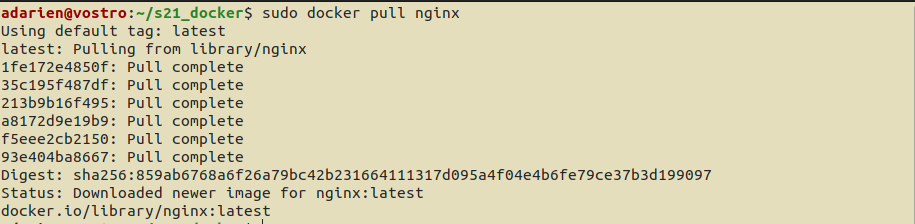

# DO5_SimpleDocker

## **Part 1. Готовый докер**

- **Взять официальный докер образ с nginx и выкачать его при помощи `docker pull`**
    
    
    
- **Проверить наличие докер образа через `docker images`**
    
    
    
- **Запустить докер образ через `docker run -d [image_id|repository]`**
- **Проверить, что образ запустился через `docker ps`**
    
    
    
- **Посмотреть информацию о контейнере через `docker inspect [container_id|container_name]`**
    
    
    
- **По выводу команды определить и поместить в отчёт размер контейнера, список замапленных портов и ip контейнера**
    
    "ShmSize": 67108864
    
    "Ports": {"80/tcp": null}
    
    "IPAddress": "172.17.0.2”
    
- **Остановить докер образ через `docker stop [container_id|container_name]`**
    
    
    
- **Проверить, что образ остановился через `docker ps`**
    
    
    
- **Запустить докер с замапленными портами 80 и 443 на локальную машину через команду *run***
    
    
    
- **Проверить, что в браузере по адресу *localhost:80* доступна стартовая страница nginx**
    
    
    
- **Перезапустить докер образ через `docker restart [image_id|repository]`**
    
    
    
- **Проверить любым способом, что контейнер запустился**
    
    
    

## **Part 2. Операции с контейнером**

- **Прочитать конфигурационный файл *nginx.conf* внутри докер образа через команду *exec***
    
    
    
- **Создать на локальной машине файл *nginx.conf***
    
    
    
- **Настроить в нем по пути */status* отдачу страницы статуса сервера nginx**
    
    
    
- **Скопировать созданный файл *nginx.conf* внутрь докер образа через команду `docker cp`**
    
    
    
- **Перезапустить nginx внутри докер образа через команду *exec***
    
    
    
- **Проверить, что по адресу *localhost:80/status* отдается страничка со статусом сервера nginx**
    
    
    
- **Экспортировать контейнер в файл *container.tar* через команду *export***
    
    
    
- **Остановить контейнер**
    
    
    
- **Удалить образ через `docker rmi [image_id|repository]`, не удаляя перед этим контейнеры**
    
    
    
- **Импортировать контейнер обратно через команду *import***
    
    
    
- **Запустить импортированный контейнер**
    
    
    

## ...
